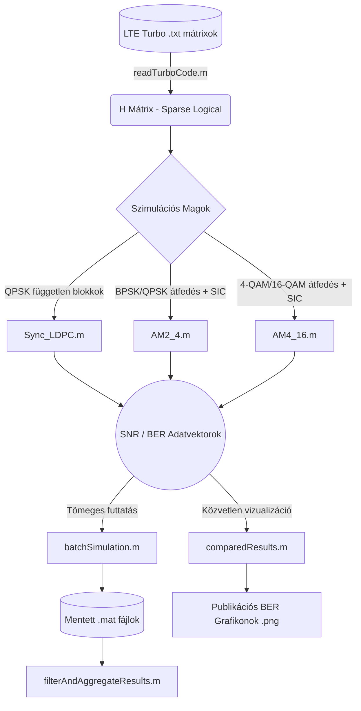

# LTE Turbo Kódok: Szinkron és Aszinkron Átviteli Rendszerek Szimulációs Keretrendszere


Ez a repository egy párhuzamosított MATLAB keretrendszert tartalmaz 3GPP LTE Turbo kódok paritásellenőrző mátrixainak (H) vizsgálatára additív fehér Gauss-zajos (AWGN) csatornán. A rendszer célja a hagyományos, ortogonális blokkokat használó **szinkron átvitel**, valamint a szuperponált, egymást félig átfedő **aszinkron (AM2-4 és AM4-16)** láncolt modulációk szisztematikus összehasonlítása. 

A vevőoldal egységesen ritka mátrixos Belief Propagation (BP / `ldpcDecode`) algoritmust és szekvenciális interferencia-kioltást (SIC – Successive Interference Cancellation) alkalmaz.

---

## 📂 Fájlrendszer és Mappastruktúra

A keretrendszer moduláris felépítésű, bemeneti és kimeneti könyvtárakra támaszkodik:

```text
📁 Projekt_Gyoker/
│
├── 📁 bemeneti_lte_turbo_matrixok/    # Bemeneti .txt paritásmátrixok
│   ├── LTE_TC_N156_K48.txt
│   ├── LTE_TC_N228_K72.txt
│   └── LTE_TC_N300_K96.txt
│
├── 📁 Osszehasonlito_Eredmenyek/      # Ide generálódnak a .png ábrák és .mat adatok
│   ├── Osszehasonlitas_AM2_4.png
│   └── Osszehasonlitas_AM4_16.png
│
├── ⚙️ Szimulációs Magfüggvények (Cores)
│   ├── Sync_LDPC.m                    # Független QPSK szinkron referencia
│   ├── AM2_4.m                        # BPSK / QPSK aszinkron átfedéses lánc
│   └── AM4_16.m                       # 4-QAM / 16-QAM aszinkron átfedéses lánc
│
├── 🛠️ Bemeneti Adatfeldolgozó
│   └── readTurboCode.m                # Paritásmátrix-beolvasó és ellenőrző
│
└── 🚀 Vezérlő és Elemző Szkriptek
    ├── comparedResults.m              # Fő vizualizációs és összehasonlító futtató
    ├── batchSimulation.m              # Tömeges mérés .mat fájlba mentéssel
    └── filterAndAggregateResults.m    # Mérési eredmények aggregálása és szűrése
```

---

## 🔄 Rendszerarchitektúra és Adatfolyam



---

## 🧩 Részletes Modulleírás és API Referencia

### 1. Bemeneti Feldolgozó

#### `readTurboCode.m`
Beolvassa a szöveges fájlban (`.txt`) tárolt paritásellenőrző mátrixot, kiszűri az üres indexeket, és előállítja a MATLAB kódoló és dekódoló objektumai által megkövetelt ritka, logikai struktúrát.

* **Bemenetek:**
  * `matrixPath` *(String / char)*: A bemeneti mátrixfájl abszolút vagy relatív elérési útja.
* **Kimenetek:**
  * `H` *(sparse logical matrix)*: Az M \times N dimenziójú ritka paritásellenőrző mátrix.

```matlab
% Használati példa:
H = readTurboCode('bemeneti_lte_turbo_matrixok/LTE_TC_N156_K48.txt');
fprintf('Mátrix mérete: %d sor x %d oszlop\n', size(H, 1), size(H, 2));
```

---

### 2. Szimulációs Magfüggvények

Minden magfüggvény `parfor` ciklussal párhuzamosítja az SNR pontonkénti keretszámítást.

#### `Sync_LDPC.m` (Szinkron Referencia)
Független, egymást nem átfedő blokkok átvitelét szimulálja AWGN csatornán QPSK modulációval. A vett jelet közvetlenül Log-Likelihood Ratio (LLR) formátumra bontja, majd az `ldpcDecode` függvénnyel dekódolja. Nincs szimbólumközi interferencia és nincs hibaterjedés.

* **Bemenetek:**
  * `H` *(sparse logical)*: A paritásellenőrző mátrix.
  * `maxFrames` *(integer)*: Szimulált keretek száma SNR-pontonként (pl. `1000`).
  * `snrRange` *(vector)*: Jel-zaj viszony pontok dB-ben (pl. `2:0.5:8`).
* **Kimenetek:**
  * `Ldpc_ErrP` *(double vector)*: Átlagos bithibaarány (BER) vektor az adott SNR pontokon.
  * `n` *(integer)*: Információs bitek száma kódszavanként (N - M).
  * `BlockLengthHalf` *(integer)*: A kódszóhossz fele bitekben (N/2).

```matlab
% Használati példa:
snrRange = 2:0.5:8;
maxFrames = 500;
[ber_sync, n, BlockHalf] = Sync_LDPC(H, maxFrames, snrRange);
```

#### `AM2_4.m` (Aszinkron BPSK / QPSK Lánc)
Megvalósítja a K kódszóból álló aszinkron átfedéses szuperpozíciót. A lánc első szimbóluma BPSK, a közbenső K-1 blokk QPSK átfedés, míg a záró szimbólum szintén tiszta BPSK. A vevő szekvenciálisan dekódolja az aktuális blokkot, rekonstruálja a szimbólumot, és kivonja (SIC) az átfedett jelből a következő blokk dekódolása előtt.

* **Bemenetek:**
  * `H` *(sparse logical)*: Paritásellenőrző mátrix.
  * `maxFrames` *(integer)*: Keretszám SNR pontonként (alapértelmezett: `1000`).
  * `K` *(integer)*: A szuperponált láncban lévő kódszavak száma (alapértelmezett: `20`).
  * `snrRange` *(vector)*: SNR tartomány dB-ben (alapértelmezett: `1:0.5:5`).
  * `calcPlace` *(binary, 0/1)*: Logikai kapcsoló a hibák láncon belüli pozíciójának gyűjtésére.
* **Kimenetek:**
  * `TurboErr` *(double vector)*: Átlagos BER vektor.
  * `n` *(integer)*: Információs bitek száma.
  * `BlockLengthHalf` *(integer)*: Fél kódszóhossz bitben.
  * `place` *(1 x K vector)*: Legtöbb hibát tartalmazó pozíciók hisztogramja.

```matlab
% Használati példa:
[ber_am24, n, BlockHalf, place] = AM2_4(H, 500, 10, 1:0.5:6, 0);
```

#### `AM4_16.m` (Aszinkron 4-QAM / 16-QAM Lánc)
Magasabb spektrális hatékonyságú eljárás, ahol az átfedések 16-QAM konstellációt képeznek durva és finom bitek kombinációjával. A vevőoldalon `approxllr` és zajvariancia-korrekció (`CLEAN_NVFAC = 5/4`) gondoskodik a stabil szimbólumkivonásról.

* **Bemenetek és kimenetek:** Megegyeznek az `AM2_4.m` szignatúrájával.
* **Javasolt SNR tartomány:** `8:1:15` dB a 16-QAM finom bitjeinek alacsonyabb zajtűrése miatt.

```matlab
% Használati példa:
[ber_am416, n, BlockHalf, ~] = AM4_16(H, 500, 10, 8:1:15, 0);
```

---

### 3. Vezérlő és Elemző Szkriptek

#### `batchSimulation.m`
Automatizált kötegelt futtatásra tervezett modul. Végighalad a bemeneti mappában lévő összes mátrixon, lefuttatja a kiválasztott magfüggvényt (pl. `AM2_4` vagy `AM4_16`), és fájlonként egy-egy `.mat` konténert hoz létre a kimeneti mappában.
* **Elmentett változók a `.mat` fájlban:** `BlockLengthHalf`, `n`, `K`, `TurboErr`, `snrRange`.

#### `filterAndAggregateResults.m`
Post-processing eszköz az elkészült `.mat` eredményfájlok szelektív beolvasására. Lehetővé teszi kódsebesség (R = n/N), blokkhossz vagy paraméterek szerinti szűrést, több mérés átlagolását, és trendvonalak előállítását.

#### `comparedResults.m`
A rendszer legfontosabb demonstrációs szkriptje. Egyetlen folyamatban:
1. Elindítja a többmagos környezetet (`parpool`).
2. Beolvassa a kódmátrixokat.
3. Egymás mellett futtatja le a szinkron (`Sync_LDPC`) és az aszinkron (`AM2_4` és `AM4_16`) szimulációkat azonos feltételek mellett.
4. Publikációra alkalmas, logaritmikus BER vízesésgrafikonokat rajzol ki, és 300 DPI felbontásban elmenti őket a kimeneti mappába.

---

## 🚀 Gyorsindítási Útmutató (Quick Start)

1. **Előfeltételek:** MATLAB R2023a vagy újabb verzió és Communications Toolbox + Parallel Computing Toolbox.
2. **Mátrixok elhelyezése:** Másold be a vizsgálandó LTE Turbo mátrixokat a `bemeneti_lte_turbo_matrixok/` mappába.
3. **Futtatás:** Nyisd meg a MATLAB-ot, navigálj a gyökérmappába, majd a Command Window-ban add ki az alábbi utasítást:

```matlab
comparedResults
```

A szimuláció lefutása után a diagramok azonnal megtekinthetők az `Osszehasonlito_Eredmenyek/` könyvtárban:
* `Osszehasonlitas_AM2_4.png`
* `Osszehasonlitas_AM4_16.png`

---

## 📈 Eredmények Értelmezése és Tudományos Megállapítások

A mérések kiértékelésekor figyelembe veendő elméleti szempontok:

* **SIC Hibaterjedés Alacsony SNR-nél:** Az aszinkron eljárás BPSK horgonyzása magasabb jel-zaj viszonynál meredek letörést biztosít. Alacsony SNR mellett azonban a rövid LTE kódok (N < 300) paritásmátrixaiban meglévő rövid hurkok (cycle-4 és cycle-6) miatt az `ldpcDecode` néha meghagy 1-2 hibás bitet. Az első blokk hibás bitje a szimbólumkivonáskor (SIC) felerősíti az interferenciát a második blokk felé, ami dominóeffektusként lerontja a lánc fennmaradó részét.
* **16-QAM Finom Bitek Érzékenysége:** Az `AM4_16` 16-QAM modulációjában a finom bitek energia-hozzájárulása fele akkora, mint a durva biteké. Ezért az AM4-16 eljárás letörési tartománya elméletileg is 4-6 dB-lel magasabb SNR-t követel meg, mint az AM2-4.